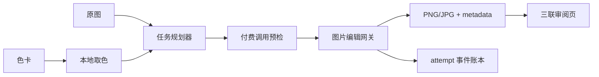
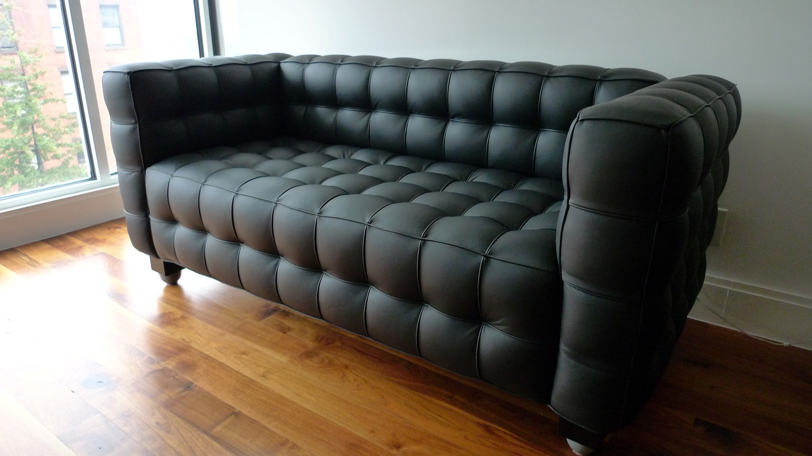
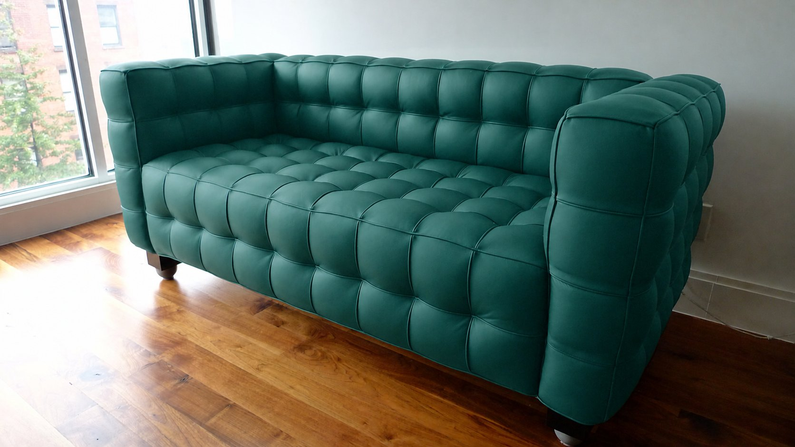

# Subject Recolor

按色卡给任意指定主体（窗帘、沙发、雨伞、帐篷等）批量换色的生成式图片生产流水线：把原图 × 色卡展开为笛卡尔积，经 OpenAI 兼容的图片编辑接口产出结果，内置付费调用安全、严格缓存、断点恢复与人工复核。

仓库是同一项目的两段演进而非两个竞争项目：

- **根目录**：较早的可复现工程基线。CLI 覆盖 `doctor → plan → 确认 → run → review`，人可直接运行，也可作为 DSH 对话智能体的后端。
- **[`新方案交接落地`](新方案交接落地/00_README_先看这里.md)**：后续生产交付版本。直接原因是真实非技术用户无法独立操作 CLI，因此增加了 Agent 代操作、小白手册、一次性单图单色入口和可断点恢复的批量入口。



## 项目亮点

- **主体可配置**：主体保存在 `job.toml`，CLI仍可临时覆盖。
- **明确的版本边界**：根目录是较早的可复现工程基线；`新方案交接落地` 是在真实非技术用户无法独立操作 CLI 后形成的生产交付演进，不是重复项目。
- **内容寻址缓存**：只有 metadata 的 `task_id` 和 PNG/JPG 哈希全部匹配才会跳过。
- **付费调用对账**：`--expect-calls N` 防止智能体或用户基于过期计划扩大批次。
- **保守失败语义**：根目录基线对超时/断线等未知结果停止批次；后续生产版进一步将其固化为付费调用安全状态机。
- **精确产物**：模型 PNG 字节原样原子落盘，JPG 从 PNG 派生。
- **人机两用**：交互式确认适合人，`plan + --expect-calls + --yes` 适合智能体。
- **离线完整 Demo**：无需 API Key 即可生成合成输入、结果、metadata和审阅页。
- **DSH Skill**：仓库自带智能体操作手册，不要求动态 Cordis plugin。

## 真实公开授权案例

下图使用 Wikimedia Commons 的 CC BY-SA 3.0 照片进行了一次真实 `/images/edits` 测试。请求模型为 `gpt-image-2`，目标色为深青绿 `#2F6B63`；结果完整保留了皮革高光、绗缝、缝线和背景构图。

| 原图 | 目标色卡 | 换色结果 |
|---|---|---|
|  |  |  |

> “Kubus sofa” by Wikidapit, [CC BY-SA 3.0](https://creativecommons.org/licenses/by-sa/3.0/), via [Wikimedia Commons](https://commons.wikimedia.org/wiki/File:Kubus_sofa.jpg). Modified by Subject Recolor. 本仓库中的修改版本同样按 CC BY-SA 3.0 提供；项目代码仍为 MIT。

完整评估、许可和来源：

- `examples/public-furniture-test/EVALUATION.md`
- `examples/public-furniture-test/ATTRIBUTION.md`
- `examples/public-furniture-test/SOURCES.json`

## 5 分钟体验

```bash
python -m venv .venv
# Windows: .venv\Scripts\activate
# macOS/Linux: source .venv/bin/activate
pip install -e ".[dev]"

# 完全离线；结果不是 AI 生成，只用于展示完整流水线
subject-recolor demo --workspace demo-workspace
```

打开：

```text
demo-workspace/2026-01-15/output/review.html
```

## 创建真实任务

```bash
subject-recolor init --date 2026-09-02 --subject 雨伞
```

目录：

```text
workspace/2026-09-02/
├── job.toml
├── input/
├── color_cards/
└── output/
    ├── png/
    ├── jpg/
    ├── metadata/
    ├── run.jsonl
    ├── run-report.json
    └── review.html
```

`job.toml`：

```toml
subject = "雨伞"
model = "gpt-image-2"
color_crop_size = 200
```

将图片放入目录后预检：

```bash
subject-recolor doctor
subject-recolor plan --date 2026-09-02
```

筛选原图与色卡做单次烟雾测试：

```bash
subject-recolor plan --date 2026-09-02 --inputs umbrella_front --cards navy --limit 1
```

## 连接图片编辑网关

项目调用：

```text
POST {IMAGE_API_BASE_URL}/images/edits
multipart/form-data
```

本项目**不会自动读取 `.env`**。`environment.example`只是Shell变量示例。

```powershell
$env:IMAGE_API_BASE_URL = "https://your-gateway.example/v1"
$env:IMAGE_API_KEY = "..."
```

人工运行可以交互确认：

```bash
subject-recolor run --date 2026-09-02
```

自动化或智能体应使用 `plan --json` 读取机器可解析的 `new_calls`，再通过 `--expect-calls` 固定对账，并以 `--max-paid-calls` 设置独立成本上限：

```bash
subject-recolor plan --date 2026-09-02 --json
subject-recolor run --date 2026-09-02 --expect-calls 1 --max-paid-calls 1 --yes
```

如果计划变化，CLI拒绝执行。

## 输出和严格缓存

每个结果对应一个 sidecar：

```text
output/metadata/original__navy.json
```

缓存要求同时满足：

1. metadata 中的 `task_id` 等于当前任务；
2. PNG/JPG存在且可解码；
3. PNG/JPG SHA-256 与metadata一致。

`task_id`覆盖原图、色卡、主体、模型、提示词和提示词版本。因此将主体从“沙发”改成“雨伞”不会错误复用旧产物。同一目录内的输入或色卡不允许出现同stem不同扩展名，例如 `scene.jpg` 与 `scene.png`。

## 安全状态

| 状态 | 含义 | 行为 |
|---|---|---|
| `submitted` | 请求已从本地发出 | 保存 request ID |
| `succeeded` | 响应与产物已确认 | 可严格缓存 |
| `failed_safe` | 收到明确非成功HTTP响应 | 记录后继续 |
| `rejected` | 400/401/403 | 停止整批 |
| `uncertain` | 超时/连接中断，上游结果未知 | 停止整批，禁止自动重试 |

`uncertain` 既不代表一定计费，也不代表一定未计费。后续生产交付版的默认执行路线是方案 B；方案 A 只允许逐项明确复核，绝不自动执行 A+B。HTTP 503 属于结果不确定，禁止自动重试；只有 HTTP 429 和已确认请求未建立连接时，才允许一次有界重试。request ID 仅用于链路追踪，不提供幂等保证。

## 审阅页

```bash
subject-recolor review --date 2026-09-02
```

审阅页并排显示：

```text
原图 | 色卡 | 换色结果
```

并展示主体、RGB/HEX、色卡一致性、task ID、模型和人工验收清单。

## DSH 智能体调用

这正是仓库内 Skill 的用途：

- `skills/subject-recolor/SKILL.md`：智能体操作手册；
- `docs/dsh/INSTALL-SKILL.md`：安装到用户自建 DSH preset 的方法；
- `docs/AGENT_WORKFLOW.md`：CLI与Skill的职责边界。

Skill是“智能体应该如何调用本项目”的说明，不是模型或API。动态 Cordis plugin不是必需项；CLI才是可移植、可测试和可在GitHub复现的执行层。

## 图片编辑 API 排障

项目要求真正的源图编辑接口 `POST /images/edits`，不能用 `/images/generations` 静默替代。若网关由另一名运维人员或智能体管理，可直接交付：

- `docs/IMAGE_EDIT_API.md`：公开的请求字段、响应契约和超时/幂等语义；
- `subject-recolor doctor`：只检查配置，不发起图片请求；
- `subject-recolor plan --json`：免费生成机器可读调用计划。

当前客户端期望 `data[0].b64_json`，解码后必须是保持原图宽高比的 PNG。仅返回 URL 的网关暂不兼容。

## 颜色与质量边界

生成模型不会令主体所有像素等于目标 HEX。RGB/HEX 是目标颜色基准；高光、阴影、反光和透明度仍会形成颜色分布。正式验收应检查完整换色、非目标区域保持、材质/结构、深浅色细节和边缘污染。

当前采用无mask语义编辑。像素级背景一致性场景应增加人工标注或可靠分割mask。

## 测试

根目录工程基线：

```bash
python -m ruff check .
python -m pytest --cov=subject_recolor
```

生产交付版的现场回归测试须从各自目录运行：

```powershell
Push-Location "新方案交接落地/正式工具_batch_recolor_tool"
$env:PYTHONPATH = "."
python -m unittest -v tests.test_offline tests.test_curl_local_integration
Pop-Location

Push-Location "新方案交接落地/一次性换色脚本"
python -m unittest -v test_once_offline
Pop-Location
```

预期现场回归结果为批处理 13 项、一次性入口 3 项通过。这些测试使用本机 localhost 假 API，不访问付费端点，也不产生付费调用。

根目录 CI 配置覆盖 Python 3.11、3.12 和 3.13；根目录单元测试使用合成图片与 `httpx.MockTransport`，无需网络、真实照片或 API Key。

## 隐私

- 不提交真实API Key、客户图片或完整Base64响应；
- `.gitignore`排除工作区、输出和本地缓存；
- 公开效果图前确认图片版权、人物隐私和网关条款。

## License

MIT
